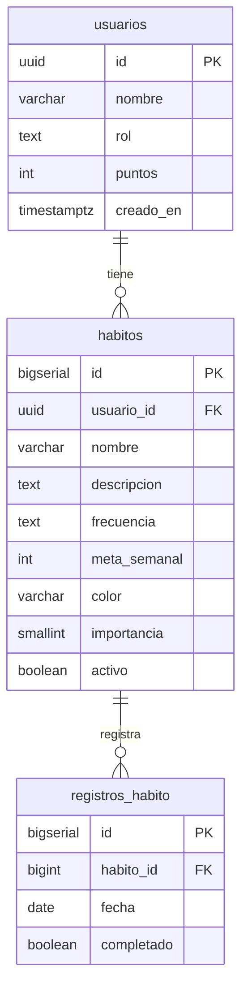

# HabitTracker

Aplicación web de seguimiento de hábitos con gamificación. Proyecto Final — Programación Web 2026A, UDG.

**Stack:** HTML · CSS · JavaScript · Supabase (PostgreSQL + Auth) · Vercel

---

## Diagrama Entidad-Relación

---

## Usuarios demo

| Correo | Contraseña | Rol |
|--------|-----------|-----|
| jefe@habittracker.com | Jefe2026! | admin |
| admin@admin.com | Admin2026! | admin |
| demo@habittracker.com | Demo2026! | user |
| carlos@demo.com | Carlos2026! | user |
| sofia@demo.com | Sofia2026! | user |
| maria@demo.com | Maria2026! | user |
